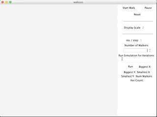

# Simulation Specification

## Demo

## TODO
[https://docs.google.com/document/d/1ZiuWXCt2R6VJhi4gJ9Ioh0zyY4dZL7d4ZuxnsBEnp2w/edit?usp=sharing](https://docs.google.com/document/d/1ZiuWXCt2R6VJhi4gJ9Ioh0zyY4dZL7d4ZuxnsBEnp2w/edit?usp=sharing)

## Description
Simulation of different objects in a X-Y plane

## Simulation Objects
- Walker: every step, randomly moves 1 space up, down, left, or right (not all moves are always possible, explained below)
- Wall: walkers can't move into a space with a wall
- Magnet: "attratcs" or "repels" walkers by altering the probability dist of the walker's possilbe moves

## Simulation Rules

## Collision Rules 
Should be fair (point's order in list shouldn't affect outcome)

1. On simulation step: if 2 adjacent points, BOTH points cannot move to the direction with an adjacent point

These actions are only allowed when the simulation is reset:

2. Adding a walker: spiral around origin until a free spot is found
3. Resetting walkers' position: place walkers in a spiral around origin
4. Toggling collisions on: turning this on should reset the walkers (above) 
